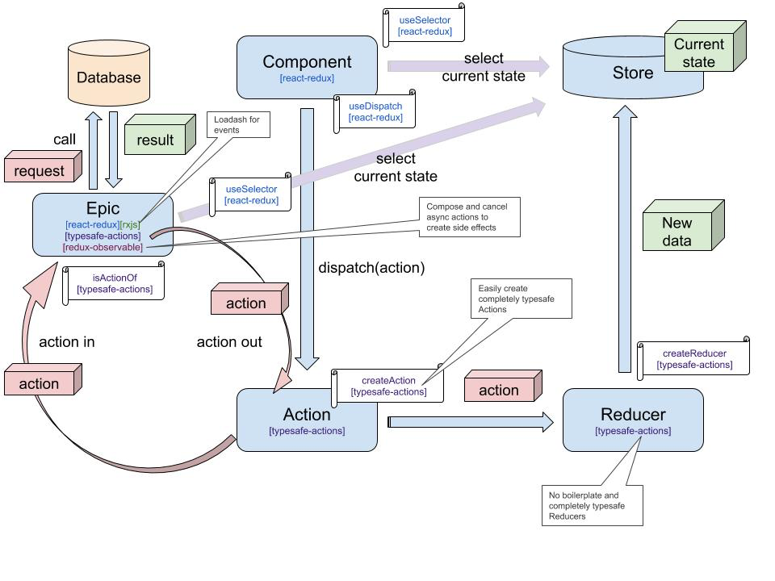

# Reduxとその周辺Libraryの図解

## react-redux

> Official React bindings for [Redux](https://github.com/reduxjs/redux).  
> Performant and flexible.



## rxjs

Observerパターンを使った非同期とイベントのためのライブラリ。 イベントで渡ってきたデータを自由に加工することができる

> RxJS is a library for composing asynchronous and event-based programs by using observable sequences. It provides one core type, the [Observable](https://rxjs-dev.firebaseapp.com/guide/observable), satellite types \(Observer, Schedulers, Subjects\) and operators inspired by [Array\#extras](https://developer.mozilla.org/en-US/docs/Web/JavaScript/New_in_JavaScript/1.6) \(map, filter, reduce, every, etc\) to allow handling asynchronous events as collections.



## typesafe-actions

型安全なActionや非同期Action、Reducerを簡単に作成することが出来る。

> * Easily create completely typesafe [Actions](https://github.com/piotrwitek/typesafe-actions#action-creators-api) or even [Async Actions](https://github.com/piotrwitek/typesafe-actions#createasyncaction)
> * No boilerplate and completely typesafe [Reducers](https://github.com/piotrwitek/typesafe-actions#reducer-creators-api)
> * Game-changing [Helper Types](https://github.com/piotrwitek/typesafe-actions#type-helpers-api) for Redux



## redux-observable

Reduxでの非同期処理ミドルウェア。Actionを受け取り、Actionを返すEpicを作成する。

> [RxJS](http://github.com/ReactiveX/RxJS)-based middleware for [Redux](http://github.com/reactjs/redux). Compose and cancel async actions to create side effects and more.



