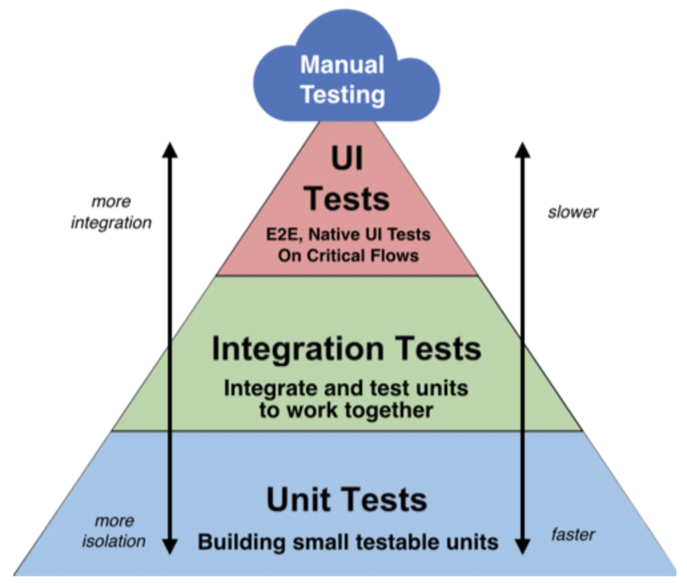

# Test

## Unit Tests

入力をモック化し、個々の関数やクラスをテストし、出力結果が予想通りであることを確認するテスト

* 入力をモック化したユニットを提供\(6\) 
* アウトプットが予想通りであることを確認\(3\) 
* カバレッジレポートツール\(7\)を必ず使用して、どのユニットがカバーされたのかを確認

## Integration Tests

 いくつかのモジュールを組み合わせて予想通りに動作することを保証するテスト

* 重要なモジュール間を横断する内部シナリオを定義 単体テストと比べると、単にアウトプットをアサーションするのではなく、予想通りの振る舞いであるかをテストするためにスパイやスタブを使用する\(6\) UI上で、ブラウザや疑似ブラウザ環境により、プロセスと結果が統合されているかをテストする

## **E2E Tests**

製品自体を使って（例えばブラウザを使って）、あるシナリオをテストする。確実に想定した動作をするかといった内部構造は考慮しない。

* ユーザの振る舞いを模したシナリオを実行する際に、プログラム可能なAPIによるブラウザ、または疑似ブラウザ環境\(8\)を使用

## テストツールの役割

1. テストの環境を提供する（Jest） 
2. テストの構造を提供する（Jest） 
3. アサーション機能を提供する（Jest） 
4. 生成、表示、テスト結果をウォッチする（Jest） 
5. 以前の実行時からの変更が意図されたものであることを確認するために、コンポーネントやデータ構造を生成し、スナップショットを比較する（Jest） 
6. モック、スパイ、スタブを提供する（Jest\) 
7. コードカバレッジのレポートを生成する（Jest\) 
8. シナリオ実行の管理ができるブラウザ、または疑似ブラウザの環境を提供する（）

| @testing-library/react | [https://testing-library.com/docs/react-testing-library/intro/](https://testing-library.com/docs/react-testing-library/intro/) | The React Testing Library is a very light-weight solution for testing React components. It provides light utility functions on top of react-dom and react-dom/test-utils, in a way that encourages better testing practices. Its primary guiding principle is: |
| :--- | :--- | :--- |
| @testing-library/react-hooks | [https://react-hooks-testing-library.com/](https://react-hooks-testing-library.com/) | The react-hooks-testing-library allows you to create a simple test harness for React hooks that handles running them within the body of a function component, as well as providing various useful utility functions for updating the inputs and retrieving the outputs of your amazing custom hook. |
| @testing-library/jest-dom | [https://testing-library.com/docs/ecosystem-jest-dom](https://testing-library.com/docs/ecosystem-jest-dom) | jest-dom is a companion library for Testing Library that provides custom DOM element matchers for Jest |
| @testing-library/user-event | [https://testing-library.com/docs/ecosystem-user-event/](https://testing-library.com/docs/ecosystem-user-event/) | user-event is a companion library for Testing Library that provides more advanced simulation of browser interactions than the built-in fireEvent method. |
| jest | [https://jestjs.io/](https://jestjs.io/) | Jest is a delightful JavaScript Testing Framework with a focus on simplicity. |
| redux-mock-store | [https://github.com/reduxjs/redux-mock-store](https://github.com/reduxjs/redux-mock-store) | A mock store for testing Redux async action creators and middleware. The mock store will create an array of dispatched actions which serve as an action log for tests. |
| ts-jest | [https://kulshekhar.github.io/ts-jest/](https://kulshekhar.github.io/ts-jest/) | A TypeScript preprocessor with source map support for Jest that lets you use Jest to test projects written in TypeScript. |
| typesafe-actions | [https://github.com/piotrwitek/typesafe-actions](https://github.com/piotrwitek/typesafe-actions) | Typesafe utilities designed to reduce types verbosity and complexity in Redux Architecture. This library is part of the React & Redux TypeScript Guide ecosystem |

